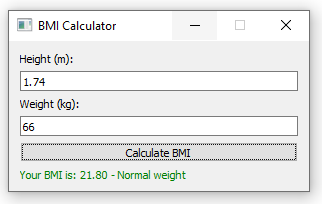

# bmi-calculator

An application which calculates the body mass index (BMI).

## Setup

Clone the `bmi-calculator` repository on your local machine.

Open a `PowerShell` terminal inside the `bmi-calculator` repository.

Create a virtual environment `.venv`:

    python -m venv .venv

Activate the `.venv`:

    .venv\Scripts\activate

Install the requirements:

    pip install -r requirements.txt

Finally, deactivate the `.venv` as follows:

    deactivate

## BMI Categories

The following BMI categories classification according to the World Health Organization (WHO) was used:

| Category                       | BMI Range      |
| ------------------------------ | -------------- |
| **Underweight**                | Less than 18.5 |
| **Normal weight**              | 18.5 – 24.9    |
| **Overweight**                 | 25 – 29.9      |
| **Obesity Class I (Moderate)** | 30 – 34.9      |
| **Obesity Class II (Severe)**  | 35 – 39.9      |
| **Obesity Class III (Morbid)** | 40 and above   |

## Example of Use

## Acknowledgments

This project was created with assistance from an AI assistant.

Special thanks to [Microsoft Copilot](https://www.microsoft.com/copilot) for providing valuable guidance and support throughout the development process.
